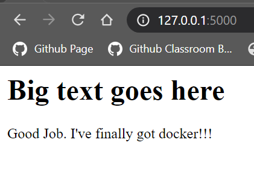

# CEG3120 Final Project Write-up

## Project Overview/Checklist:

### Milestone 1:
- [x] Created Public Repository
- [x] Cloned Repo to local machine
- [x] Dockerized my website using 127.0.0.1:5000 and index.html file 
### Milestone 2:
- [x] Downloaded the aws command line
- [x] Created an ECR Repository
- [x] Setup a workflow in github
- [x] Tested it with a Reference tag

## Installation/Setup Requirements:
- [x] Install Docker
- [x] Install AWS CLI
- [x] Install WSL2

## Milestone 1 Overview:

### Step 1:
- Setup and Clone the public repository from Pilot!
	- Create a new ssh key on your local machine
	- Add the public key to github
	- On your local machine clone the created public repository using the `ssh` tab 
### Step 2:
- Setup a Docker Repository!
	- Go to the Docker App. Create a Get-Started Image by copying the command given.
	- Type `docker ps` to see the container in action
	- Kill the container by typing `docker kill [name]'
	- Create a New Docker Repository with the httpd:2.4 installed.
	- The command is `docker pull httpd:2.4`
	- Build the webserver in your repository:
		- `docker build -t [name of image] .` : This builds the image in the directory `.` specified
		- `docker run -d -p 5000:80 [name of image]` : This runs the image on the local machine with port 80 binded to it. 
### Step 3:
- Build a Docker Repository with your own index.html!
	- Create a html directory in your public repo
		- Inside the html file create an index.html file and add some content.
	- Create a Docker file named `Dockerfile` exactly inside your public repo.
	- Add the following lines to the file:
		- `FROM httpd:2.4` : This pulls the apache2 things
		- `COPY ./html/ /usr/local/apache2/htdocs/` : This line copies the index.html file from .html and put it  into apache2 for Docker to use  it.
	- Save the Dockerfile
### Final Step:
- Go to [127.0.0.1:5000](http://127.0.0.1:5000/)

1. It should look like this. 

